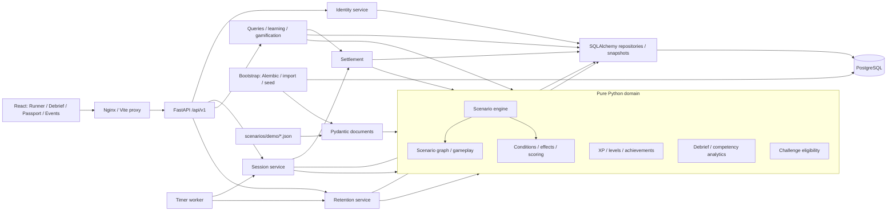
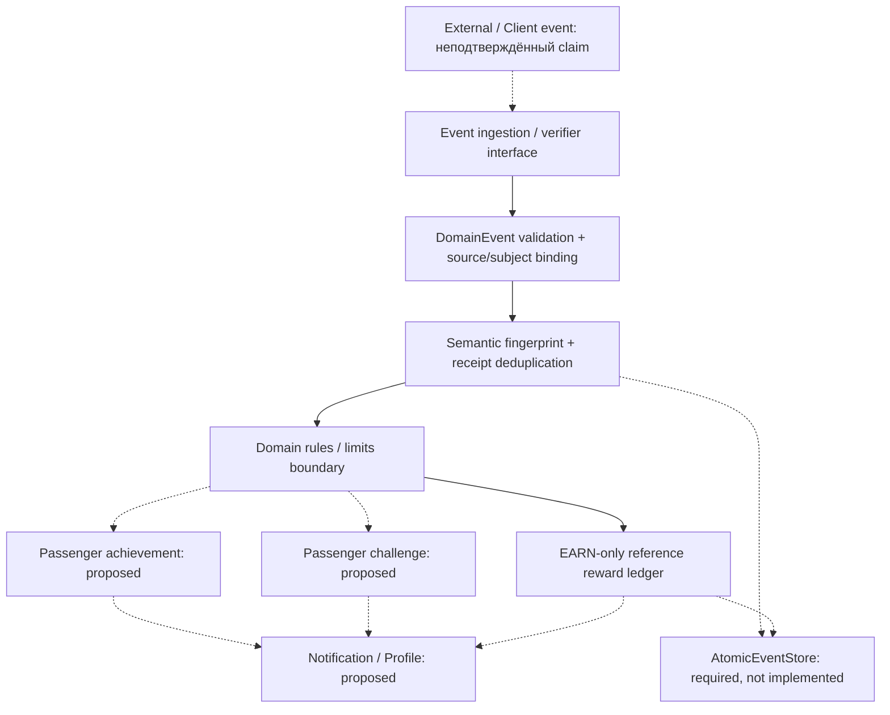

# Доменная архитектура ВСМ

## Назначение и границы

Обучающий симулятор решений проводника. Продуктовый scope уточнён владельцем
на этапе 2; [история первоначального противоречия](PRODUCT_SCOPE_HISTORY.md)
сохранена. После новой QA-сессии назначение будущего продукта вновь требует
уточнения: [MEETUP_ALIGNMENT](MEETUP_ALIGNMENT.md). Текущая реализация остаётся
учебной. Пассажирская валюта, ticketing и реальная HR/LMS-интеграция отсутствуют.

Реализованы пять JSON-сценариев, независимый движок, серверные таймеры,
сохранение попыток, demo auth, игровой UI, награды, достижения, рейтинги,
обучающий разбор, аналитика, challenges и внутренние уведомления.
[Ограничения демо](LIMITATIONS.md) отделяют это от production-системы.

## Component diagram



`app/domain/` использует только стандартную библиотеку Python. Время и ID
передаются извне; домен не знает HTTP, ORM, React, окружения и системных часов.
Pydantic валидирует внешние документы/снимки, application services владеют
транзакциями и используют SQLAlchemy. Универсальные ports/unit-of-work
абстракции пока не выделены. Readiness `app/db.py` не импортируется доменом.

React показывает серверный снимок и отправляет намерение: node/choice/decision ID
и ожидаемую ревизию. API не принимает клиентские loyalty/safety/XP/время.
Сохранённая в sessionStorage команда позволяет безопасно повторить запрос
после обрыва. Отсчёт браузера информационный, timeout фиксирует сервер.
Тексты новых веток берутся из JSON без изменения React.

## Запуск и хранение

Compose поднимает PostgreSQL 17, одноразовый bootstrap, FastAPI, отдельный
worker и Nginx с собранным React. Bootstrap ждёт readiness БД, применяет Alembic,
валидирует/импортирует JSON и публикует два синтетических челленджа. Backend
и worker ждут успешного завершения bootstrap. Nginx ждёт `/ready` backend.
Все host-порты loopback; они настраиваются отдельно от внутренних портов сервисов.

Сценарии монтируются read-only. Версии JSON, снимки сессий с историей, профили,
хеши токенов, ключи старта, reward ledger, определения/разблокировки достижений,
челленджи и уведомления сохраняются в PostgreSQL. Единственный том — данные БД;
пересборка контейнеров не сбрасывает прогресс. Повторный импорт не переписывает
версию, seed не продлевает кампанию. Это локальный single-database deployment.

Решение: блокировка строки сессии → время БД → восстановление истории →
проверка timeout/choice → новый снимок → однократная награда при завершении → commit.
Worker использует `SKIP LOCKED`; один переход выигрывает гонку. Уникальные ключи
защищают повторные старт, reward и unlock. Уведомления формируются по сохранённым
фактам отдельно, с дедупликацией; задержка worker до минуты допустима,
GET входящих восстанавливает пропущенные события.
[Sequence diagram](SCENARIO_ENGINE.md#sequence-diagram-обработка-decision).

## Модули и сущности

| Модуль          | Типы                                                                     | Ответственность                                                   |
| --------------- | ------------------------------------------------------------------------ | ----------------------------------------------------------------- |
| `scenario`      | Scenario, ScenarioNode, Choice                                           | Версионируемый граф, ссылки, таймер и исход таймаута              |
| `engine`        | Чистые функции start/advance/expire и запросы                            | Переходы, повторы, таймауты и проверка истории                    |
| `gameplay`      | ScenarioSession, Decision, SessionStatus                                 | Снимок прохождения и запись принятого решения                     |
| `scoring`       | MetricRef, ScoreState, AddScore, ScoreBounds, ScoringPolicy, ScoreChange | Независимые показатели, clamp и журнал изменений                  |
| `rules`         | Predicate, Condition                                                     | Ограниченные сравнения и ALL/ANY                                  |
| `competencies`  | Competency, CompetencyProgress                                           | Каталог компетенций и накопленные баллы                           |
| `profiles`      | EmployeeProfile                                                          | Идентификатор сотрудника и прогресс компетенций                   |
| `achievements`  | Achievement, AchievementUnlock                                           | Правило достижения и факт выдачи                                  |
| `gamification`  | RewardFact, Progress, BehaviorAchievement                                | Награда завершённой попытки, XP, уровень и поведенческий прогресс |
| `notifications` | Notification                                                             | Сообщение получателю, время создания/прочтения                    |
| `analytics`     | SessionSummary                                                           | Чистая сводка снимка сессии, без записи и внешних вызовов         |

Идентификаторы — непустые строки. Primary key защищает ID сохранённых сессий;
ID решений уникальны внутри истории попытки, что проверяется под блокировкой
строки. Награда уникальна по session_id, разблокировка — по профилю и версии
достижения. Уведомления хранятся с уникальным ключом получателя/события, read_at и expires_at.
Ссылки на profile/session/achievement не означают
наличие ORM relationship. Типы — frozen dataclasses; коллекции копируются
в tuple или read-only mapping, чтобы внешнее изменение не меняло снимок.
Время передаётся явно, только timezone-aware datetime, и нормализуется в UTC
при создании значения. Сравнения и длительность используют абсолютное время,
включая повторяющийся местный час при смене UTC offset. В домене нет часов,
генерации ID, I/O, глобального mutable state и обращения к окружению.

## Сценарии как данные

Scenario содержит `id`, положительную `version`, `title`, `start_node_id`,
`nodes` и `competency_ids`. Пара `(id, version)` определяет опубликованную версию.
ScenarioNode содержит текст, локальные choices, `terminal` и необязательные
`time_limit_seconds` / `timeout_choice_id`. Choice содержит локальный id, текст,
target_node_id, Condition, tuple эффектов и explanation. В домене explanation
по умолчанию пусто для совместимости типов этапа 2; внешний JSON-контракт
требует непустое объяснение каждого перехода. Терминальный узел не имеет choices;
обычный узел имеет хотя бы один. Таймер требует безусловный timeout choice.

Проверка графа отклоняет повторные node/choice/competency IDs, неизвестные цели,
несуществующий старт, недостижимые узлы и узлы без структурного пути к завершению.
Домен допускает циклы, если из каждого узла есть путь к terminal. JSON-контракт
дополнительно запрещает циклы при `cycle_policy: forbid` (по умолчанию);
`allow` сохраняет доменное правило. Это структурная
проверка: она не доказывает выполнимость условий. Автор контента должен оставлять
доступный выход. Движок возвращает пустой набор доступных выборов, сохраняя
активный статус, если условия закрыли все варианты. При наличии таймера остаётся
служебный переход через `expire`; отсутствие выборов не превращает узел в финал.

Новая развилка — новые данные ScenarioNode/Choice, а не новый Python handler.
Пример в unit-тестах строит два варианта графа одним набором типов. JSON DTO
и загрузчик реализованы в `app/scenarios/`; редактор пока внешний. Формат DSL
имеет версию 1; новая
операция требует явного изменения модели, тестов и версии формата, новый
сценарий на существующих операциях — нет.

## JSON-контракт и PostgreSQL persistence

Исходники контента — `scenarios/demo/*.json`. Pydantic-модели с `strict=True`,
`extra="forbid"` и `frozen=True` отделены от доменных dataclass. Коллекции
преобразуются в tuple; строки, float и boolean не принимаются как целые числа.
Загрузчик запрещает повторные JSON-ключи. После проверки полей DTO преобразуется
в Scenario, который проверяет ссылки и достижимость. Запрет циклов использует
итеративный алгоритм Кана, включая timeout-рёбра. Формат и пределы описаны
в [scenarios/README.md](../scenarios/README.md).

JSON timeout отделён от обычных choices и не принимает condition. Его destination
отличается от целей обычных выборов того же узла. Адаптер преобразует timeout
в безусловный доменный Choice с зарезервированным ID `__timeout__`.
Пользовательские ID не могут совпасть с ним. Для API это
служебный выбор: движок исключает его из `available_choices` и отклоняет
в `advance`. Только `expire` может применить наступивший таймаут.

Миграция `20260926_01` создаёт таблицу `scenario_versions`:

| Поле       | Тип         | Ограничение                                                   |
| ---------- | ----------- | ------------------------------------------------------------- |
| id         | varchar(64) | часть primary key                                             |
| version    | integer     | часть primary key, > 0                                        |
| document   | jsonb       | NOT NULL, объект с совпадающими id/version и schema_version=1 |
| created_at | timestamptz | NOT NULL, серверное время записи                              |

JSONB выбран, потому что версия графа загружается и публикуется целиком.
Нормализация узлов/выборов по таблицам пока не нужна; сценарий не содержит
данных сотрудников. Миграция не импортирует текущие модели: её DDL зафиксирован
для воспроизводимого развёртывания. `create_all` не используется.

`ScenarioRepository.add` перепроверяет документ и выполняет INSERT ON CONFLICT
DO NOTHING. Совпадающее содержимое возвращает «без изменений», другое содержимое
с тем же ключом вызывает ScenarioVersionConflict. Параллельные импорты защищены
primary key; ожидаемый уровень изоляции — PostgreSQL READ COMMITTED. `get(id,
version)` загружает и повторно валидирует ровно запрошенную версию. Метода обновления
версии нет. Неизменяемость обеспечивает репозиторий; административный SQL-доступ
может изменить запись, поэтому production-права доступа потребуют отдельной настройки.

Вызывающий код владеет SQLAlchemy Session и commit/rollback. CLI сначала проверяет
все файлы, затем импортирует пакет одной транзакцией; при конфликте пакет целиком
откатывается. Миграции и импорт запускаются явно, без побочных действий при старте
FastAPI. Репозиторий возвращает внешний DTO, преобразуемый через `to_domain()`;
домен не обращается к Pydantic, SQLAlchemy, файловой системе или окружению.

## Условия и эффекты (DSL v1)

- Разрешённые показатели: `passenger_loyalty`, `safety_rating`, `competency`.
  У competency обязателен competency_id, у остальных он запрещён.
- Predicate сравнивает показатель с целым числом: `eq`, `ne`, `gt`, `gte`,
  `lt`, `lte`. Condition объединяет до 64 предикатов через `all` или `any`.
  Пустой `all` означает «всегда»; пустой `any` запрещён. Вложенных выражений нет.
- AddScore прибавляет целую дельту к разрешённому показателю. Порядок эффектов
  сохранён в tuple. Движок суммирует дельты одной метрики, затем один раз
  ограничивает Loyalty/Safety её min/max и записывает ScoreChange.
  Компетенции остаются без диапазона. Результат — новый ScoreState.
- Неизвестные операции, метрики и ссылки отклоняются. Отсутствующая метрика
  не считается нулём. Все используемые метрики должны быть явно инициализированы.
  Условия проверяют все предикаты до ALL/ANY, не скрывая неверную ссылку
  за коротким замыканием.
- Не допускаются исходный код, arbitrary eval/exec, динамический импорт,
  вызовы функций из контента, выражения путей/атрибутов, SQL или JavaScript.

Пример части JSON-выбора (condition и effects находятся на одном уровне):

```json
{
  "condition": {
    "mode": "all",
    "predicates": [
      { "metric": "safety_rating", "operator": "gte", "value": 10 }
    ]
  },
  "effects": [
    {
      "type": "add_score",
      "metric": "competency",
      "competency_id": "service",
      "delta": 2
    }
  ]
}
```

Числа в контенте — синтетическая балансировка. DSL хранит целые дельты,
а ScoringPolicy задаёт отдельные границы Loyalty/Safety (по умолчанию 0–100).
Сервис создаёт попытку с 50/50 и компетенциями 0; политика закрепляется в сессии.
Клиент не задаёт баллы или диапазоны. Уровни и перенос прогресса между попытками
определены отдельно в [GAMIFICATION.md](GAMIFICATION.md). Подробности clamp и журнала — в
[GAME_MECHANICS.md](GAME_MECHANICS.md).

## Сессии, решения и согласованность

ScoreState принадлежит одной попытке. CompetencyProgress в EmployeeProfile —
долгосрочный прогресс; это отдельная проекция, а не ссылка на текущие баллы
попытки. На этапе 8 суммируется положительный итоговый прирост компетенции
за завершённые попытки. Это правило находится в gamification, отдельно от AddScore.
Условие Achievement первой версии архитектуры проверяется по финальному ScoreState;
поведенческие достижения этапа 8 используют отдельные RewardFact и журнал наград,
включая историю решений и серии между попытками.

ScenarioSession хранит id, employee_id, scenario_id/version, current_node_id,
начальные и текущие ScoreState, ScoringPolicy, started_at, status, completed_at
и упорядоченные Decision.
Decision хранит id, session_id, node_id, choice_id, порядковый номер, decided_at
и применённые эффекты с explanation и score_changes. Каждая запись журнала
содержит metric, before, requested_delta, after, applied_delta и explanation;
applied_delta вычисляется как after − before и проверяется в JSON-снимке.
Проверяются принадлежность решений, уникальность ID,
последовательность номеров, монотонность времени и состояние завершения.

Движок проверяет существование node/choice, доступность условия, переход,
таймер и совпадение эффектов и объяснения с выбранной версией сценария.
Запросы и команды проверяют целостность сессии повторным исполнением истории
от initial_scores. Начальные баллы обязательны для движка и содержат ровно
loyalty, safety и объявленные компетенции; чистый движок принимает их явно.
Стартовые Loyalty/Safety должны входить в закреплённые границы.
Доменный тип допускает отсутствие initial_scores для совместимости значений
этапа 2, но такой снимок не может исполняться движком.

Публичные функции `app/domain/engine.py`: `start_session`, `current_node`,
`available_choices`, `node_deadline`, `advance`, `expire` и `restore_session`.
Время и ID приходят извне. Таймаут считается по явно переданному now; deadline
вычисляется от входа в узел (started_at или последнего Decision.decided_at).
При now >= deadline новый выбор игрока отклоняется, а expire выполняет один
служебный переход. Движок не запускает часы или фоновые задачи самостоятельно.
Сессия закрепляет опубликованную версию; новая версия не меняет прошлые решения.
Контракт, state machine и пример — в [SCENARIO_ENGINE.md](SCENARIO_ENGINE.md).

Команды содержат исходный node_id и expected_sequence — число принятых решений.
Это позволяет отклонить устаревшую команду даже при повторном входе в тот же
узел в цикле. Повтор принятого decision_id с теми же узлом, выбором и номером
возвращает актуальный снимок без начислений, в том числе после завершения.
Время обработки повтора не меняет принятую запись. Конфликт содержимого при
одинаковом ID отклоняется.

`app/scenarios/session_state.py` содержит строгий внешний Pydantic-контракт
JSON-снимка формата 2 и функции `dump_session`/`load_session`. В формате
закреплены политика и журнал; сериализация и загрузка проверяют их движком.
Формат 1 явно отклоняется: в нём нельзя восстановить прежнюю политику и журнал
без догадок. До этапа 5 постоянного хранилища сессий не было, автоматической
миграции внешних файлов нет. Проверка истории подтверждает согласованность,
но не авторизацию или подлинность клиентского снимка. API принимает только команды.

Миграция `20260926_02` создаёт `scenario_sessions`: primary key id,
FK `(scenario_id, scenario_version)`, `revision`, `state`, `deadline`, JSONB `snapshot`,
`created_at` и `updated_at`. История решений и журнал находятся внутри снимка;
отдельной таблицы решений нет. Частичный индекс deadline охватывает активные
попытки со сроком. При чтении репозиторий проверяет соответствие отдельных полей
снимку; завершённая попытка не имеет deadline.

`app/application/sessions.py` блокирует строку через `SELECT FOR UPDATE`,
восстанавливает сессию, затем отдельным SQL-запросом получает PostgreSQL
`clock_timestamp()`. Время транзакции или запроса до ожидания блокировки не
используется. Если `now >= deadline`, сервис сначала сохраняет timeout; новый
запоздалый выбор получает 409 после commit таймаута. Идентичный повтор ранее
принятой команды подтверждает исходный ID и возвращает актуальное состояние,
включая возможный новый таймаут. Проверка `expected_sequence` выполняется
по заблокированному снимку. Решение, баллы, журнал, ревизия и новый deadline
сохраняются одной транзакцией: конкурентный запрос не начисляет баллы повторно.

`app/worker.py` вызывает `expire_due`: выбирает просроченные строки через
`FOR UPDATE SKIP LOCKED`, обрабатывает каждую в своей транзакции и повторяет
опрос. Deadline переживает перезапуск; браузер не нужен. GET и POST решений
также немедленно согласуют просроченное состояние. Задержка worker зависит от
интервала, нагрузки и доступности БД; точное исполнение в миллисекунду не обещается.
Следующий таймер начинается со времени фактической обработки перехода.
Повреждённая сессия протоколируется и пропускается в текущем проходе;
ошибка БД приводит к повторной попытке на следующем опросе.

Внешний outbox и доставка провайдерам не реализованы. Внутренние уведомления
сверяются по сохранённым событиям; награды и прогресс профиля
добавлены на этапе 8 и не требуют внешней очереди.
Уникальность сохранённого AchievementUnlock —
`(employee_id, achievement_id, achievement_version)`. API v1 получает employee_id из demo-токена и проверяет
владельца. Текущий Compose предназначен для локальной демонстрации,
не для публикации как готового production-сервиса.

## Проверки и план реализации

1. Проверить условия, эффекты, ошибочные графы, сессии и сущности.
2. Проверить альтернативные ветки, условия до и после эффектов, независимые
   показатели, clamp, журнал, повторы, таймеры и восстановление движком.
3. Проверить импорт всего домена в отдельном Python-процессе с `-S` без
   site-packages. Это проверяет независимость от web/ORM/test-зависимостей.
4. Выполнить Ruff, mypy, полный pytest и существующие проверки frontend;
   обновить BUILD_PLAN/README, просмотреть diff, commit и push.

Unit-тесты не требуют сервера, БД или браузера. PostgreSQL-тесты запускаются
при заданном TEST_DATABASE_URL и создают отдельную случайную схему на тест:
upgrade/check/downgrade/upgrade, сохранение/чтение, конфликт и откат, конкурентный
повторный импорт, ограничения БД и повторная валидация сохранённых документов.
Проверки сессий покрывают сохранение, двойную отправку, выбор против worker,
ожидание блокировки на границе deadline, автоматический timeout и повторный
запуск worker по сохранённому сроку.
Они не очищают рабочие таблицы; схема удаляется после теста. Доменная
аналитика включает детерминированную сводку и учебные выводы этапа 9;
продуктовые отчёты и обработка реальных персональных данных — следующие этапы.
На этапе 6 QueryService агрегирует сохранённые попытки для demo-аналитики
и лидерборда, не изменяя доменную сводку.

Полная проверка истории при запросах и командах имеет сложность порядка
O(число решений² + число решений × размер графа): каждый шаг пересоздаёт
и проверяет неизменяемую историю. Для текущих небольших демо это сознательная
простая реализация. Длительные циклические попытки потребуют отдельной политики
размера истории или проверенных контрольных точек.

## Этап 6: REST API и read models

Контракт описан в [API.md](API.md). HTTP-слой `app/api` валидирует команды,
проверяет bearer-токен, сериализует ответы и переводит ошибки в общий формат.
Он не вычисляет переходы, условия, очки или timeout. `SessionService` сохраняет
транзакции этапа 5 и проверяет владельца; новый старт связывает ключ пользователя
и сессию одной транзакцией. Домен остаётся на стандартной библиотеке Python.

`IdentityService` выдаёт случайные demo-токены с TTL 24 часа; хранилище содержит
их SHA-256 хеши. `QueryService` читает каталог, достижения и проверенные снимки
для результатов, аналитики и лидерборда. Для демо агрегаты собираются в памяти;
материализованные проекции предусмотрены будущим этапом. Определения
и разблокировки читаются из отдельных таблиц; этап 8 добавляет начисление.

Миграция 20260926_03 добавляет user_profiles, demo_tokens, session_start_keys,
achievement_definitions и achievement_unlocks. Старые session snapshots остаются
формата 2. Полный HTTP API находится под /api/v1, прежний /sessions удалён,
proxy сохраняет версионированный путь. Health/readiness остаются публичными.
HR/LMS endpoint только валидирует контракт и отвечает 501; внешнего адаптера нет.

## Этап 8: награды, профиль и организация

`app/domain/gamification.py` принимает завершённую доменную сессию и её сценарий,
вычисляет RewardFact, XP, уровень и прогресс достижений без HTTP, ORM и часов.
Проверку снимка повторным исполнением выполняет репозиторий до начисления.
В `SessionService` завершение решения или таймаута вызывает settlement в той же
транзакции. Ошибка награды откатывает финальный переход; повтор может завершить его.

`session_rewards` хранит одну награду на session_id, версию правил, XP, прирост
компетенций и поведенческие факты. `FOR NO KEY UPDATE` на профиле сериализует
начисления разных попыток, сохраняя совместимость с `KEY SHARE` внешнего ключа
идемпотентного старта. Сервис не блокирует другие строки сессий, поэтому не создаёт
обратный порядок блокировок. Первое чтение прогресса также начисляет награды за
проверенные старые завершения; уникальный ключ и блокировка исключают повтор.
Unlock записывается с версией достижения, временем и сессией-основанием.

`GamificationService` строит паспорт из журнала, а рейтинг — из суммы XP
зарегистрированных профилей с завершёнными попытками. Принадлежность компании,
депо и бригаде задаётся сервером; фильтр включает всех предков подразделения.
Для backfill рейтинга каждый профиль обрабатывается отдельной транзакцией.
Ранг учитывает равенство XP и вычисляется до пагинации. Материализация агрегатов
потребуется при росте объёма; текущая реализация рассчитана на небольшое демо.

React отображает готовые значения. Смена demo-персоны разрешена вне активной
попытки, сбрасывает привязку вкладки и отменяет чтения старого профиля. Обновление
истёкшего токена сохраняет выбранную персону. Клиент не передаёт XP, unlock или
организацию в команды. Правила и API — в [GAMIFICATION.md](GAMIFICATION.md).

## Этап 9: обучающий разбор и аналитика компетенций

Источник — структурированные Decision и ScoreChange в сохранённом JSONB-снимке
v2, проверенном повторным исполнением по неизменной версии сценария. Время, порядок,
идентификаторы, объяснения, эффекты и фактические дельты уже сохраняются атомарно.
Новая таблица событий не создаётся: дублирование дало бы второй источник истины.
Повтор команды и восстановление не создают дополнительных наблюдений.

Чистый домен последовательно восстанавливает состояние каждого посещения узла,
проверяет условия альтернатив до эффекта, применяет закреплённую ScoringPolicy
для сравнения непосредственных последствий. Рекомендация не гарантирует исход
следующих веток и не меняет scoring, XP или достижения. HTTP, БД, UI и LLM в
вычислениях не участвуют; версия правил включена в ответ.

Аналитический сервис выбирает только попытки владельца, различает активные и
завершённые, передаёт проверенные пары сценарий/сессия домену. Статистика навыков
и паттернов использует завершённые события, а не текстовый поиск в объяснениях.
Прогресс согласован с наградами этапа 8; нейтральные исходы и недостаток наблюдений
явно отделены от отрицательных. Пороги и состав паттернов описаны в
[DEBRIEF_ANALYTICS.md](DEBRIEF_ANALYTICS.md).

Frontend отображает временную линию, причины изменения шкал и доступные варианты
с рекомендацией, а в паспорте — журнал развития компетенций и статистику попыток.
Данные обновляются через авторизованный клиент; смена персоны отменяет старые чтения.

## Retention и hardening

`app/domain/retention.py` проверяет окно challenge и пригодность попытки по
серверным событиям; `app/application/retention.py` строит прогресс и inbox.
Таблицы `challenges`, `challenge_scenarios`, `notifications` введены миграцией
20260926_05. Уникальность `(employee_id, event_key)` защищает повторную сверку;
прочтение принадлежит пользователю. [Правила retention](RETENTION.md).

Миграция 20260926_06 добавляет ограничения согласованности JSON-снимка сессии,
ревизии и истории, типов reward-фактов/границ XP и формата хеша токена.
API ограничивает тело 64 KiB и не отдаёт traceback клиенту. Request/response DTO
и frontend parser проверяют контракт, но авторитетные правила исполняются
исключительно в backend. [Границы защиты](../SECURITY.md).

## Общий фундамент событий после QA

Этот раздел описывает изолированный контракт и исполняемый последовательный
прототип. Он не подключён к текущему игровому потоку и не выбирает вариант
A/B/C изменения scope. Существующие SessionService, XP, сценарии, миграции и API
сохранены. Никаких новых рабочих HTTP endpoints или внешних источников не добавлено.

### Реализованные контракты

- `app/domain/events.py`: `DomainEvent` — event_id UUID, event_type, occurred_at,
  received_at, source, subject_id, payload, schema_version. Время timezone-aware
  и нормализовано в UTC; JSON защищён от изменения, нечисловых NaN/Infinity,
  неправильной структуры и чрезмерной вложенности/размера: глубина ≤ 16,
  canonical UTF-8 JSON ≤ 64 KiB. Общий бюджет расходуется при обходе до
  копирования оставшихся ветвей, включая повторяющиеся вложенные коллекции.
- `fingerprint()` фиксирует семантическую идентичность факта: тип, источник,
  субъект, время события, версия схемы и payload. received_at не участвует:
  повторная доставка может прийти позже. Первое received_at остаётся в receipt.
  Тот же UUID с изменённым фактом — конфликт, а не новое начисление.
- `PendingClientEvent` хранит client_event_id UUID, event_type, occurred_at,
  created_at, payload, sync_status, attempts, schema_version. Это заявление
  устройства. Даже sync_status=CONFIRMED не делает его подтверждённым фактом.
- `app/application/event_ingestion.py`: `ClientEventVerifier` — интерфейс
  серверного адаптера; `EventVerification` — подтверждение/отказ/повтор позже.
  Адаптер выбирается сервером, сверяет источник, субъект, тип/версию, право на
  сущность и фактическое действие. Реального провайдера нет. Если адаптер не
  передан, `ingest_client_event` отклоняет claim без вызова reward rule.
- `SyncConfirmation` связывает локальный UUID с каноническим server event UUID.
  Повтор с другим локальным UUID не создаёт второй факт, если адаптер распознаёт
  одно действие. source/subject/received_at подтверждения сверяются с серверным
  контекстом. Сам Python-тип DomainEvent не является криптографическим доказательством.

Нельзя доверять user ID, стоимости покупки или событию, присланным браузером.
Преобразование в DomainEvent должно опираться на независимое доказательство
источника, а не на проверку синтаксиса JSON. В текущем приложении нет адаптера,
который мог бы подтвердить реальные Trip/Ticket/Food события.

### Дедупликация и ledger

`app/domain/reward_ledger.py` содержит `EventState`: immutable receipts и
RewardTransaction. `apply_event(state, event, rule=...)` возвращает новый снимок
с фактом и эффектом вместе. Точный повтор не вызывает правило; повтор с новым
received_at также не вызывает его. Событие без эффекта тоже запоминается.
Исключение в правиле не меняет исходное состояние.

`RewardRule.evaluate(event)` — граница серверного правила. `RewardGrant` задаёт
целочисленное amount, технический unit, reason и rule_id. В transaction сохраняются
id, subject_id, тип, amount, unit, причина, source_event_id, created_at и rule_id.
Баланс вычисляется по журналу отдельно для subject/unit. Имя пользовательской
валюты и перевод денег в points не заданы. XP/session_rewards не конвертируются.

В прототипе реализовано только положительное EARN. SPEND и ADJUSTMENT
зарезервированы в типе, но исполнение запрещено: политика списаний, авторизация,
недостаток средств, возвраты и корректировки не утверждены. Не создаются payment,
билеты, скидки, партнёрские обязательства или реальный баланс «Вёрст».

Гарантия reducer — последовательная обработка относительно переданного снимка.
Это **не** долговечная дедупликация между процессами и **не** гарантия exactly-once
внешней доставки. Два независимых снимка способны применить один факт каждый.
`AtomicEventStore.transact` задаёт обязательный будущий контракт сериализации и
единой durable-транзакции receipt + эффекты; реализации хранилища пока нет.
До подтверждения scope и такого адаптера результат прототипа нельзя отдавать
браузеру как подтверждение сохранённой награды. Порт не подменён молчаливым
in-memory fallback. Никаких миграций текущей БД не потребовалось.

### Концептуальная целевая схема

Пунктир обозначает неподключённые источники или будущие модули. Сплошные связи
внутри foundation показывают последовательность прототипа, не работающий event bus.



Существующие учебные достижения/челленджи на этой схеме не переподключаются.
Они продолжают читать проверенные ScenarioSession/RewardFact в PostgreSQL.

### Поздние события, offline и fraud

occurred_at описывает время факта, received_at — время получения сервером.
Поздняя доставка не должна автоматически означать позднее физическое действие.
Но допустимая задержка, доверенные часы, timezone покупки «до 7 утра», grace
period, порядок событий и исправление фактов требуют утверждённого контракта.
Envelope не выбирает эти политики и не переписывает правила учебного таймера.

Offline contract предусматривает pending/in-flight/retryable/confirmed/rejected,
стабильный UUID при retry и счётчик попыток. Browser queue, IndexedDB, service
worker, синхронизация между устройствами, retry scheduler и автоматическое
доверие клиентскому времени не реализованы. Существующий Scenario Runner
продолжает восстанавливать одну неопределённую команду через sessionStorage.

Правила/лимиты должны исполняться на сервере внутри атомарной границы; настоящие
пороговые значения и fraud-модель не придуманы. Дедупликация по каноническому ID
не обнаружит одно действие, которому ошибочно выдали два серверных UUID.
Корреляция/уникальность факта на стороне источника обязательны. Нет fingerprinting,
Госуслуг, СКУД, РЖД API или реальной проверки личности.

### Проверки

Новые unit-тесты находятся в `tests/domain/test_events.py`,
`tests/domain/test_reward_ledger.py`, `tests/test_event_ingestion.py`.
Они проверяют валидность/неизменяемость, повторы/conflicts, EARN и баланс,
недоверенный client status, mismatch источника/субъекта, retry и отсутствие
эффекта при сбое. Проверка импорта домена без site-packages остаётся обязательной.
Существующие API/PostgreSQL/E2E подтверждают сохранение учебного demo flow.
