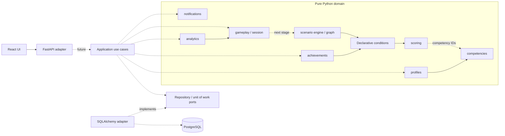

# Доменная архитектура ВСМ

## Статус и границы этапа 2

Задание владельца на этап 2 задаёт обучающую платформу и EmployeeProfile.
Для этого этапа выбран исходный учебный домен; прежнее противоречие с пассажирской
геймификацией сохранено в истории BUILD_PLAN. Валюта «Вёрсты», ticketing,
пассажирские профили и внешние интеграции не входят в эту архитектуру.

Реализуемая часть этапа: независимые доменные типы, инварианты графа, ограниченная
модель условий/эффектов, чистые вычисления scoring и unit-тесты. Полный цикл
прохождения, HTTP API сессий, ORM-модели, миграции домена, UI игры, выдача наград
и доставка уведомлений остаются будущей работой. Новых зависимостей не требуется.

## Компоненты и направление зависимостей



Диаграмма показывает целевую архитектуру. Пунктир — будущая интеграция или
ссылка по competency ID без зависимости от объекта каталога;
application use cases, порты и SQLAlchemy-адаптеры домена ещё не реализованы.
Существующий `app/db.py` обслуживает readiness инфраструктуры и не импортируется
доменом. Внутри `app/domain/` допустима только стандартная библиотека Python.
FastAPI/Pydantic DTO и SQLAlchemy записи находятся снаружи и преобразуются
в доменные значения на границе. React не исполняет авторитетные правила.

## Модули и сущности

| Модуль | Типы | Ответственность |
|---|---|---|
| `scenario` | Scenario, ScenarioNode, Choice | Версионируемый граф, ссылки, таймер и исход таймаута |
| `gameplay` | ScenarioSession, Decision, SessionStatus | Снимок прохождения и запись принятого решения |
| `scoring` | MetricRef, ScoreState, AddScore | Явные показатели и чистое применение дельт |
| `rules` | Predicate, Condition | Ограниченные сравнения и ALL/ANY |
| `competencies` | Competency, CompetencyProgress | Каталог компетенций и накопленные баллы |
| `profiles` | EmployeeProfile | Идентификатор сотрудника и прогресс компетенций |
| `achievements` | Achievement, AchievementUnlock | Правило достижения и факт выдачи |
| `notifications` | Notification | Сообщение получателю, время создания/прочтения |
| `analytics` | SessionSummary | Чистая сводка снимка сессии, без записи и внешних вызовов |

Идентификаторы — непустые строки, уникальность между агрегатами обеспечивает
будущий storage adapter. Ссылки на profile/session/achievement не означают
наличие ORM relationship. Типы — frozen dataclasses; коллекции копируются
в tuple или read-only mapping, чтобы внешнее изменение не меняло снимок.
Время передаётся явно, только timezone-aware datetime, и нормализуется в UTC
при создании значения. Сравнения и длительность используют абсолютное время,
включая повторяющийся местный час при смене UTC offset. В домене нет часов,
генерации ID, I/O, глобального mutable state и обращения к окружению.

## Сценарии как данные

Scenario содержит `id`, положительную `version`, `title`, `start_node_id`,
`nodes` и `competency_ids`. Пара `(id, version)` определяет опубликованную версию.
ScenarioNode содержит текст, локальные choices, `terminal` и необязательные
`time_limit_seconds` / `timeout_choice_id`. Choice содержит локальный id, текст,
target_node_id, Condition и tuple эффектов. Терминальный узел не имеет choices;
обычный узел имеет хотя бы один. Таймер требует безусловный timeout choice.

Проверка графа отклоняет повторные node/choice/competency IDs, неизвестные цели,
несуществующий старт, недостижимые узлы и узлы без структурного пути к завершению.
Циклы разрешены, если из каждого узла есть путь к terminal. Это структурная
проверка: она не доказывает выполнимость условий. Автор контента должен оставлять
доступный выход; будущий движок обязан обрабатывать отсутствие допустимых выборов.

Новая развилка — новые данные ScenarioNode/Choice, а не новый Python handler.
Пример в unit-тестах строит два варианта графа одним набором типов. JSON DTO,
загрузчик каталога и редактор будут внешними адаптерами следующего этапа;
готового импорта JSON на этом этапе нет. Формат DSL имеет версию 1; новая
операция требует явного изменения модели, тестов и версии формата, новый
сценарий на существующих операциях — нет.

## Условия и эффекты (DSL v1)

- Разрешённые показатели: `passenger_loyalty`, `safety_rating`, `competency`.
  У competency обязателен competency_id, у остальных он запрещён.
- Predicate сравнивает показатель с целым числом: `eq`, `ne`, `gt`, `gte`,
  `lt`, `lte`. Condition объединяет до 64 предикатов через `all` или `any`.
  Пустой `all` означает «всегда»; пустой `any` запрещён. Вложенных выражений нет.
- AddScore прибавляет целую дельту к разрешённому показателю. Порядок эффектов
  определён tuple; результат — новый ScoreState, исходный снимок не меняется.
- Неизвестные операции, метрики и ссылки отклоняются. Отсутствующая метрика
  не считается нулём. Все используемые метрики должны быть явно инициализированы.
  Условия проверяют все предикаты до ALL/ANY, не скрывая неверную ссылку
  за коротким замыканием.
- Не допускаются исходный код, arbitrary eval/exec, динамический импорт,
  вызовы функций из контента, выражения путей/атрибутов, SQL или JavaScript.

Пример декларации будущего JSON-адаптера (не исполняемый код):

```json
{
  "mode": "all",
  "predicates": [
    {"metric": "safety_rating", "operator": "gte", "value": 10}
  ],
  "effects": [
    {"type": "add_score", "metric": "competency", "competency_id": "service", "delta": 2}
  ]
}
```

Числа здесь — примеры, не утверждённая балансировка. DSL хранит целые баллы;
стартовые значения, диапазоны, ограничения, уровни и нормализация в проценты
должны быть определены отдельно. Домен не скрывает clamp или автоматический reset.

## Сессии, решения и согласованность

ScoreState принадлежит одной попытке. CompetencyProgress в EmployeeProfile —
долгосрочный прогресс; это отдельная проекция, а не ссылка на текущие баллы
попытки. Правило переноса результатов в профиль (сумма, лучший результат или
другая политика) должно быть согласовано до реализации use case завершения.
Оно не скрыто в AddScore. Условие Achievement в первой версии архитектуры
проверяется по финальному ScoreState завершённой сессии; Lifetime/cross-session
достижения требуют отдельной модели фактов и не имитируются текущими типами.

ScenarioSession хранит id, employee_id, scenario_id/version, current_node_id,
ScoreState, started_at, status, completed_at и упорядоченные Decision.
Decision хранит id, session_id, node_id, choice_id, порядковый номер, decided_at
и применённые эффекты. Проверяются принадлежность решений, уникальность ID,
последовательность номеров, монотонность времени и состояние завершения.

Факт существования node/choice, доступность условия, переход и совпадение
эффектов с выбранной версией сценария должен проверять будущий use case/engine:
снимок сессии не загружает Scenario самостоятельно. Эти типы не являются
авторизованной командой от клиента и не должны приниматься напрямую из HTTP.

Целевой интерфейс движка следующего этапа — чистая функция
`advance(scenario, session, choice_id, decision_id, now) -> new_session`.
Время и ID приходят извне. Таймаут считается по серверному now; deadline
вычисляется от входа в узел (started_at или последнего Decision.decided_at).
Сессия закрепляет опубликованную версию; новая версия не меняет прошлые решения.

Будущий application layer загружает агрегаты через порты и атомарно сохраняет
новый снимок, решение, начисления и события через unit of work. Оптимистическая
версия записи защищает от параллельных решений, decision_id — от повторной
доставки. Уникальность AchievementUnlock — `(employee_id, achievement_id)`;
правило выдачи версионируется. События аналитики и уведомления публикуются
после успешного commit через outbox. Порты, транзакции, дедупликация, outbox
и доставка в этом этапе описаны, но не реализованы.

## Проверки и план реализации

1. Написать unit-тесты условий, эффектов, ошибочных графов, сессий и сущностей.
2. Добавить `app/domain/` со стандартной библиотекой и чистыми функциями.
3. Проверить импорт всего домена в отдельном Python-процессе с `-S` без
   site-packages. Это проверяет независимость от web/ORM/test-зависимостей.
4. Выполнить Ruff, mypy, полный pytest и существующие проверки frontend;
   обновить BUILD_PLAN/README, просмотреть diff, commit и push.

Проверки не требуют сервера, БД, браузера и фиктивных интеграций. Доменная
аналитика пока даёт только детерминированную сводку сессии; долгосрочные отчёты,
агрегация между попытками и обработка персональных данных — следующие этапы.
