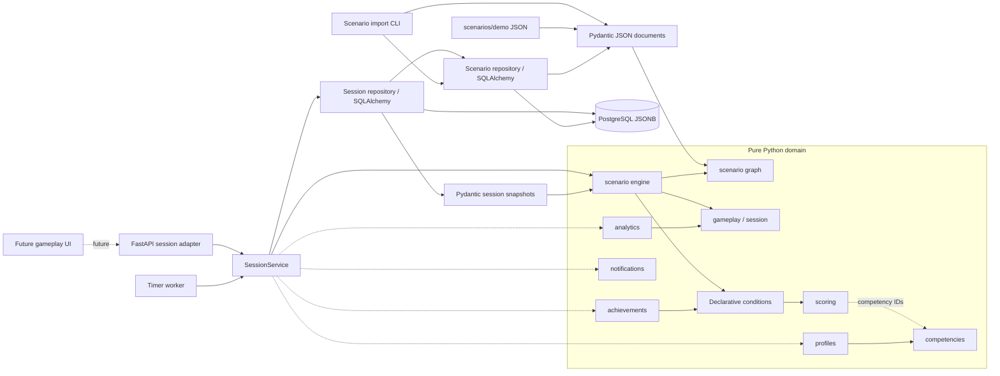

# Доменная архитектура ВСМ

## Статус и границы этапов 2–5

Задание владельца на этап 2 задаёт обучающую платформу и EmployeeProfile.
Для этого этапа выбран исходный учебный домен; прежнее противоречие с пассажирской
геймификацией сохранено в истории BUILD_PLAN. Валюта «Вёрсты», ticketing,
пассажирские профили и внешние интеграции не входят в эту архитектуру.

Реализованы независимые доменные типы, инварианты графа, ограниченная модель
условий/эффектов и чистые вычисления scoring. Этап 3 добавляет JSON/Pydantic,
хранение версий сценариев в JSONB, миграцию, CLI и три синтетических демо.
Этап 4 реализует независимый движок прохождения, таймауты, историю,
идемпотентные команды и восстановление JSON-снимка с повторным исполнением.
Этап 5 добавляет отдельные Loyalty/Safety с границами и журналом изменений,
сохранение сессий, HTTP API и worker автоматических таймаутов. UI игры,
аутентификация, долговременный прогресс, выдача наград и доставка уведомлений
остаются будущей работой. Новых зависимостей не требуется.

## Компоненты и направление зависимостей



Пунктир — будущая интеграция или ссылка по competency ID без зависимости
от объекта каталога. `SessionService` владеет транзакцией и использует
SQLAlchemy-репозитории снаружи домена. Отдельных универсальных ports/unit-of-work
абстракций пока нет. Версии сценариев читают CLI и сервис сессий; хранение
профилей, наград и уведомлений — будущая работа.
Существующий `app/db.py` обслуживает readiness инфраструктуры и не импортируется
доменом. Внутри `app/domain/` допустима только стандартная библиотека Python.
FastAPI/Pydantic DTO и SQLAlchemy записи находятся снаружи и преобразуются
в доменные значения на границе. React не исполняет авторитетные правила.

## Модули и сущности

| Модуль          | Типы                                          | Ответственность                                           |
| --------------- | --------------------------------------------- | --------------------------------------------------------- |
| `scenario`      | Scenario, ScenarioNode, Choice                | Версионируемый граф, ссылки, таймер и исход таймаута      |
| `engine`        | Чистые функции start/advance/expire и запросы | Переходы, повторы, таймауты и проверка истории            |
| `gameplay`      | ScenarioSession, Decision, SessionStatus      | Снимок прохождения и запись принятого решения             |
| `scoring`       | MetricRef, ScoreState, AddScore, ScoreBounds, ScoringPolicy, ScoreChange | Независимые показатели, clamp и журнал изменений |
| `rules`         | Predicate, Condition                          | Ограниченные сравнения и ALL/ANY                          |
| `competencies`  | Competency, CompetencyProgress                | Каталог компетенций и накопленные баллы                   |
| `profiles`      | EmployeeProfile                               | Идентификатор сотрудника и прогресс компетенций           |
| `achievements`  | Achievement, AchievementUnlock                | Правило достижения и факт выдачи                          |
| `notifications` | Notification                                  | Сообщение получателю, время создания/прочтения            |
| `analytics`     | SessionSummary                                | Чистая сводка снимка сессии, без записи и внешних вызовов |

Идентификаторы — непустые строки. Primary key защищает ID сохранённых сессий;
ID решений уникальны внутри истории попытки, что проверяется под блокировкой
строки. Для прочих агрегатов storage adapter ещё не реализован.
Ссылки на profile/session/achievement не означают
наличие ORM relationship. Типы — frozen dataclasses; коллекции копируются
в tuple или read-only mapping, чтобы внешнее изменение не меняло снимок.
Время передаётся явно, только timezone-aware datetime, и нормализуется в UTC
при создании значения. Сравнения и длительность используют абсолютное время,
включая повторяющийся местный час при смене UTC offset. В домене нет часов,
генерации ID, I/O, глобального mutable state и обращения к окружению.

## Сценарии как данные

Scenario содержит `id`, положительную `version`, `title`, `start_node_id`,
`nodes` и `competency_ids`. Пара `(id, version)` определяет опубликованную версию.
ScenarioNode содержит текст, локальные choices, `terminal` и необязательные
`time_limit_seconds` / `timeout_choice_id`. Choice содержит локальный id, текст,
target_node_id, Condition, tuple эффектов и explanation. В домене explanation
по умолчанию пусто для совместимости типов этапа 2; внешний JSON-контракт
требует непустое объяснение каждого перехода. Терминальный узел не имеет choices;
обычный узел имеет хотя бы один. Таймер требует безусловный timeout choice.

Проверка графа отклоняет повторные node/choice/competency IDs, неизвестные цели,
несуществующий старт, недостижимые узлы и узлы без структурного пути к завершению.
Домен допускает циклы, если из каждого узла есть путь к terminal. JSON-контракт
дополнительно запрещает циклы при `cycle_policy: forbid` (по умолчанию);
`allow` сохраняет доменное правило. Это структурная
проверка: она не доказывает выполнимость условий. Автор контента должен оставлять
доступный выход. Движок возвращает пустой набор доступных выборов, сохраняя
активный статус, если условия закрыли все варианты. При наличии таймера остаётся
служебный переход через `expire`; отсутствие выборов не превращает узел в финал.

Новая развилка — новые данные ScenarioNode/Choice, а не новый Python handler.
Пример в unit-тестах строит два варианта графа одним набором типов. JSON DTO
и загрузчик реализованы в `app/scenarios/`; редактор пока внешний. Формат DSL
имеет версию 1; новая
операция требует явного изменения модели, тестов и версии формата, новый
сценарий на существующих операциях — нет.

## JSON-контракт и PostgreSQL persistence

Исходники контента — `scenarios/demo/*.json`. Pydantic-модели с `strict=True`,
`extra="forbid"` и `frozen=True` отделены от доменных dataclass. Коллекции
преобразуются в tuple; строки, float и boolean не принимаются как целые числа.
Загрузчик запрещает повторные JSON-ключи. После проверки полей DTO преобразуется
в Scenario, который проверяет ссылки и достижимость. Запрет циклов использует
итеративный алгоритм Кана, включая timeout-рёбра. Формат и пределы описаны
в [scenarios/README.md](../scenarios/README.md).

JSON timeout отделён от обычных choices и не принимает condition. Его destination
отличается от целей обычных выборов того же узла. Адаптер преобразует timeout
в безусловный доменный Choice с зарезервированным ID `__timeout__`.
Пользовательские ID не могут совпасть с ним. Для API это
служебный выбор: движок исключает его из `available_choices` и отклоняет
в `advance`. Только `expire` может применить наступивший таймаут.

Миграция `20260926_01` создаёт таблицу `scenario_versions`:

| Поле       | Тип         | Ограничение                                                   |
| ---------- | ----------- | ------------------------------------------------------------- |
| id         | varchar(64) | часть primary key                                             |
| version    | integer     | часть primary key, > 0                                        |
| document   | jsonb       | NOT NULL, объект с совпадающими id/version и schema_version=1 |
| created_at | timestamptz | NOT NULL, серверное время записи                              |

JSONB выбран, потому что версия графа загружается и публикуется целиком.
Нормализация узлов/выборов по таблицам пока не нужна; сценарий не содержит
данных сотрудников. Миграция не импортирует текущие модели: её DDL зафиксирован
для воспроизводимого развёртывания. `create_all` не используется.

`ScenarioRepository.add` перепроверяет документ и выполняет INSERT ON CONFLICT
DO NOTHING. Совпадающее содержимое возвращает «без изменений», другое содержимое
с тем же ключом вызывает ScenarioVersionConflict. Параллельные импорты защищены
primary key; ожидаемый уровень изоляции — PostgreSQL READ COMMITTED. `get(id,
version)` загружает и повторно валидирует ровно запрошенную версию. Метода обновления
версии нет. Неизменяемость обеспечивает репозиторий; административный SQL-доступ
может изменить запись, поэтому production-права доступа потребуют отдельной настройки.

Вызывающий код владеет SQLAlchemy Session и commit/rollback. CLI сначала проверяет
все файлы, затем импортирует пакет одной транзакцией; при конфликте пакет целиком
откатывается. Миграции и импорт запускаются явно, без побочных действий при старте
FastAPI. Репозиторий возвращает внешний DTO, преобразуемый через `to_domain()`;
домен не обращается к Pydantic, SQLAlchemy, файловой системе или окружению.

## Условия и эффекты (DSL v1)

- Разрешённые показатели: `passenger_loyalty`, `safety_rating`, `competency`.
  У competency обязателен competency_id, у остальных он запрещён.
- Predicate сравнивает показатель с целым числом: `eq`, `ne`, `gt`, `gte`,
  `lt`, `lte`. Condition объединяет до 64 предикатов через `all` или `any`.
  Пустой `all` означает «всегда»; пустой `any` запрещён. Вложенных выражений нет.
- AddScore прибавляет целую дельту к разрешённому показателю. Порядок эффектов
  сохранён в tuple. Движок суммирует дельты одной метрики, затем один раз
  ограничивает Loyalty/Safety её min/max и записывает ScoreChange.
  Компетенции остаются без диапазона. Результат — новый ScoreState.
- Неизвестные операции, метрики и ссылки отклоняются. Отсутствующая метрика
  не считается нулём. Все используемые метрики должны быть явно инициализированы.
  Условия проверяют все предикаты до ALL/ANY, не скрывая неверную ссылку
  за коротким замыканием.
- Не допускаются исходный код, arbitrary eval/exec, динамический импорт,
  вызовы функций из контента, выражения путей/атрибутов, SQL или JavaScript.

Пример части JSON-выбора (condition и effects находятся на одном уровне):

```json
{
  "condition": {
    "mode": "all",
    "predicates": [
      { "metric": "safety_rating", "operator": "gte", "value": 10 }
    ]
  },
  "effects": [
    {
      "type": "add_score",
      "metric": "competency",
      "competency_id": "service",
      "delta": 2
    }
  ]
}
```

Числа в контенте — синтетическая балансировка. DSL хранит целые дельты,
а ScoringPolicy задаёт отдельные границы Loyalty/Safety (по умолчанию 0–100).
Сервис создаёт попытку с 50/50 и компетенциями 0; политика закрепляется в сессии.
Клиент не задаёт баллы или диапазоны. Уровни и перенос прогресса между попытками
ещё не определены. Подробности clamp и журнала — в
[GAME_MECHANICS.md](GAME_MECHANICS.md).

## Сессии, решения и согласованность

ScoreState принадлежит одной попытке. CompetencyProgress в EmployeeProfile —
долгосрочный прогресс; это отдельная проекция, а не ссылка на текущие баллы
попытки. Правило переноса результатов в профиль (сумма, лучший результат или
другая политика) должно быть согласовано до реализации use case завершения.
Оно не скрыто в AddScore. Условие Achievement в первой версии архитектуры
проверяется по финальному ScoreState завершённой сессии; Lifetime/cross-session
достижения требуют отдельной модели фактов и не имитируются текущими типами.

ScenarioSession хранит id, employee_id, scenario_id/version, current_node_id,
начальные и текущие ScoreState, ScoringPolicy, started_at, status, completed_at
и упорядоченные Decision.
Decision хранит id, session_id, node_id, choice_id, порядковый номер, decided_at
и применённые эффекты с explanation и score_changes. Каждая запись журнала
содержит metric, before, requested_delta, after, applied_delta и explanation;
applied_delta вычисляется как after − before и проверяется в JSON-снимке.
Проверяются принадлежность решений, уникальность ID,
последовательность номеров, монотонность времени и состояние завершения.

Движок проверяет существование node/choice, доступность условия, переход,
таймер и совпадение эффектов и объяснения с выбранной версией сценария.
Запросы и команды проверяют целостность сессии повторным исполнением истории
от initial_scores. Начальные баллы обязательны для движка и содержат ровно
loyalty, safety и объявленные компетенции; чистый движок принимает их явно.
Стартовые Loyalty/Safety должны входить в закреплённые границы.
Доменный тип допускает отсутствие initial_scores для совместимости значений
этапа 2, но такой снимок не может исполняться движком.

Публичные функции `app/domain/engine.py`: `start_session`, `current_node`,
`available_choices`, `node_deadline`, `advance`, `expire` и `restore_session`.
Время и ID приходят извне. Таймаут считается по явно переданному now; deadline
вычисляется от входа в узел (started_at или последнего Decision.decided_at).
При now >= deadline новый выбор игрока отклоняется, а expire выполняет один
служебный переход. Движок не запускает часы или фоновые задачи самостоятельно.
Сессия закрепляет опубликованную версию; новая версия не меняет прошлые решения.
Контракт, state machine и пример — в [SCENARIO_ENGINE.md](SCENARIO_ENGINE.md).

Команды содержат исходный node_id и expected_sequence — число принятых решений.
Это позволяет отклонить устаревшую команду даже при повторном входе в тот же
узел в цикле. Повтор принятого decision_id с теми же узлом, выбором и номером
возвращает актуальный снимок без начислений, в том числе после завершения.
Время обработки повтора не меняет принятую запись. Конфликт содержимого при
одинаковом ID отклоняется.

`app/scenarios/session_state.py` содержит строгий внешний Pydantic-контракт
JSON-снимка формата 2 и функции `dump_session`/`load_session`. В формате
закреплены политика и журнал; сериализация и загрузка проверяют их движком.
Формат 1 явно отклоняется: в нём нельзя восстановить прежнюю политику и журнал
без догадок. До этапа 5 постоянного хранилища сессий не было, автоматической
миграции внешних файлов нет. Проверка истории подтверждает согласованность,
но не авторизацию или подлинность клиентского снимка. API принимает только команды.

Миграция `20260926_02` создаёт `scenario_sessions`: primary key id,
FK `(scenario_id, scenario_version)`, `revision`, `state`, `deadline`, JSONB `snapshot`,
`created_at` и `updated_at`. История решений и журнал находятся внутри снимка;
отдельной таблицы решений нет. Частичный индекс deadline охватывает активные
попытки со сроком. При чтении репозиторий проверяет соответствие отдельных полей
снимку; завершённая попытка не имеет deadline.

`app/application/sessions.py` блокирует строку через `SELECT FOR UPDATE`,
восстанавливает сессию, затем отдельным SQL-запросом получает PostgreSQL
`clock_timestamp()`. Время транзакции или запроса до ожидания блокировки не
используется. Если `now >= deadline`, сервис сначала сохраняет timeout; новый
запоздалый выбор получает 409 после commit таймаута. Идентичный повтор ранее
принятой команды подтверждает исходный ID и возвращает актуальное состояние,
включая возможный новый таймаут. Проверка `expected_sequence` выполняется
по заблокированному снимку. Решение, баллы, журнал, ревизия и новый deadline
сохраняются одной транзакцией: конкурентный запрос не начисляет баллы повторно.

`app/worker.py` вызывает `expire_due`: выбирает просроченные строки через
`FOR UPDATE SKIP LOCKED`, обрабатывает каждую в своей транзакции и повторяет
опрос. Deadline переживает перезапуск; браузер не нужен. GET и POST решений
также немедленно согласуют просроченное состояние. Задержка worker зависит от
интервала, нагрузки и доступности БД; точное исполнение в миллисекунду не обещается.
Следующий таймер начинается со времени фактической обработки перехода.
Повреждённая сессия протоколируется и пропускается в текущем проходе;
ошибка БД приводит к повторной попытке на следующем опросе.

Outbox, доставка событий, проекции профиля и выдача наград ещё не реализованы.
Будущая уникальность AchievementUnlock — `(employee_id, achievement_id)`;
правило выдачи потребуется версионировать. Минимальный API не содержит
аутентификации: employee_id утверждает вызывающая сторона. Текущий Compose
предназначен для локальной демонстрации, не для публикации как готового сервиса.

## Проверки и план реализации

1. Проверить условия, эффекты, ошибочные графы, сессии и сущности.
2. Проверить альтернативные ветки, условия до и после эффектов, независимые
   показатели, clamp, журнал, повторы, таймеры и восстановление движком.
3. Проверить импорт всего домена в отдельном Python-процессе с `-S` без
   site-packages. Это проверяет независимость от web/ORM/test-зависимостей.
4. Выполнить Ruff, mypy, полный pytest и существующие проверки frontend;
   обновить BUILD_PLAN/README, просмотреть diff, commit и push.

Unit-тесты не требуют сервера, БД или браузера. PostgreSQL-тесты запускаются
при заданном TEST_DATABASE_URL и создают отдельную случайную схему на тест:
upgrade/check/downgrade/upgrade, сохранение/чтение, конфликт и откат, конкурентный
повторный импорт, ограничения БД и повторная валидация сохранённых документов.
Проверки сессий покрывают сохранение, двойную отправку, выбор против worker,
ожидание блокировки на границе deadline, автоматический timeout и повторный
запуск worker по сохранённому сроку.
Они не очищают рабочие таблицы; схема удаляется после теста. Доменная
аналитика пока даёт только детерминированную сводку сессии; долгосрочные отчёты,
агрегация между попытками и обработка персональных данных — следующие этапы.

Полная проверка истории при запросах и командах имеет сложность порядка
O(число решений² + число решений × размер графа): каждый шаг пересоздаёт
и проверяет неизменяемую историю. Для текущих небольших демо это сознательная
простая реализация. Длительные циклические попытки потребуют отдельной политики
размера истории или проверенных контрольных точек.
