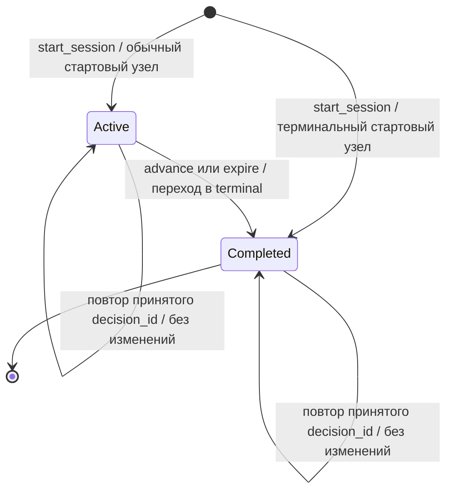

# Сценарный движок

`backend/app/domain/engine.py` исполняет нелинейный граф сценария: создаёт
попытку, определяет текущий узел и доступные варианты, проверяет условия,
применяет эффекты, выполняет переходы и сохраняет историю решений.
Движок использует только стандартную библиотеку Python. UI, HTTP API,
репозиторий сессий, часы, генерация ID и фоновые задачи находятся вне него.

Входы — неизменяемые `Scenario`, `ScenarioSession` и явные параметры команды.
Выход — новый снимок сессии; прежний снимок не изменяется. Одинаковые входы
дают одинаковый результат. Время `now` и ID задаёт вызывающий код.
На этапе 5 этот код — `SessionService`, который читает серверное время БД,
сохраняет сессии и вызывается API либо отдельным worker. HTTP-контракт,
автоматический запуск таймаутов и правила баллов — в
[GAME_MECHANICS.md](GAME_MECHANICS.md).

## Публичный интерфейс

Все функции находятся в `app.domain.engine`:

| Функция                                                                                                    | Результат и назначение                                                          |
| ---------------------------------------------------------------------------------------------------------- | ------------------------------------------------------------------------------- |
| `start_session(scenario, *, session_id, employee_id, initial_scores, now, scoring_policy=ScoringPolicy())` | Начальный `ScenarioSession`, закреплённый за `scenario.id/version` и политикой. |
| `current_node(scenario, session)`                                                                          | Текущий `ScenarioNode` после проверки сессии.                                   |
| `available_choices(scenario, session, *, now)`                                                             | Кортеж доступных обычных `Choice` в порядке документа.                          |
| `node_deadline(scenario, session)`                                                                         | Момент истечения текущего таймера либо `None`.                                  |
| `advance(scenario, session, *, node_id, choice_id, decision_id, expected_sequence, now)`                   | Применение одного допустимого решения игрока.                                   |
| `expire(scenario, session, *, node_id, decision_id, expected_sequence, now)`                               | Применение одного наступившего таймаута.                                        |
| `restore_session(scenario, session)`                                                                       | Проверка снимка полным повторным исполнением истории.                           |

Неверная команда или несовместимый снимок вызывают `DomainError`.
`expected_sequence` — число уже принятых решений: для первой команды это `0`,
для следующей — `1`. Номер нового `Decision` равен `expected_sequence + 1`.

`initial_scores` задаётся явно как `ScoreState`. Набор метрик должен в точности
содержать `passenger_loyalty`, `safety_rating` и каждую объявленную в сценарии
компетенцию. Неизвестные, лишние и отсутствующие метрики отклоняются.
Чистый движок не выбирает стартовые баллы: пример ниже использует нули,
а серверный сервис — 50/50 и компетенции 0. ScoringPolicy по умолчанию задаёт
отдельные границы 0–100 для Loyalty/Safety; начальные значения должны входить
в диапазоны. Политика сохраняется в сессии. Другую политику может передать
доверенный вызывающий код, но HTTP-клиент не может изменить её или баллы.

Функции, принимающие сессию, проверяют её историю и соответствие переданному
сценарию. `current_node` возвращает доменную модель, включая служебный timeout
choice. Будущий UI должен получать варианты через `available_choices`,
а не отображать `current_node(...).choices` напрямую.

## Состояния и переходы



`ACTIVE` и `COMPLETED` — значения `SessionStatus`. У терминального узла нет
выборов. Переход в него сразу выставляет `COMPLETED` и `completed_at=now`.
Если стартовый узел терминальный, сессия завершается при создании, без решений,
с `completed_at=started_at`. Новое решение после завершения отклоняется.

Пустой список доступных вариантов не означает завершение. Условия могут
закрыть все обычные варианты; тогда сессия остаётся активной. Если есть таймер,
можно дождаться его и вызвать `expire`. Без таймера автор должен исправить
контент или начальные условия, оставив достижимый выход. Проверка графа
доказывает структурный путь к финалу, но не выполнимость условий.

## Обработка команды

1. Проверить идентификаторы, формат времени, закреплённую версию сценария
   и целостность переданного снимка повторным исполнением истории.
2. Найти `decision_id` в истории. Если это повтор той же команды, вернуть
   переданный актуальный снимок без изменений. Если ID принадлежит другой
   команде, отклонить запрос.
3. Для нового решения проверить активность сессии, `expected_sequence`
   и `node_id`. Проверка номера обязательна и при повторном посещении того же
   узла в цикле: старый экран не может принять решение за новый вход в узел.
4. Проверить монотонность `now`, таймер и принадлежность выбора текущему узлу.
   Для `advance` исключить служебный timeout choice и проверить `condition`
   по баллам до применения эффектов. Для `expire` проверить наступление срока.
5. Суммировать `Choice.effects` для каждой затронутой метрики и один раз
   применить её границы. Создать `Decision` с номером, временем, исходными
   эффектами, `explanation` и `score_changes`. Компетенции не ограничиваются.
6. Перейти в `target_node_id`, добавить запись в конец истории и завершить
   сессию, если целевой узел терминальный. Вернуть новый `ScenarioSession`.

Ошибка не оставляет частично применённых баллов или решений: входные значения
неизменяемы. Условия и эффекты берутся из сценария, а не из команды игрока.
Несколько выборов могут вести в один узел и сохраняют собственные последствия
и объяснения. Циклы разрешены доменом; JSON-контракт требует явного
`cycle_policy: "allow"`, если они нужны автору.

## Повторы, время и конкуренция

Идентичность принятой команды определяется `decision_id`, исходным `node_id`,
выбором, видом операции (`advance` или `expire`) и `expected_sequence`.
`now` — время обработки, оно не входит в
идентичность повтора. При повторной доставке движок сохраняет первоначальные
время, эффекты и историю; новые баллы не начисляются. Возвращается актуальная
переданная сессия, даже если после исходного решения уже были другие переходы
или завершение. Повтор не возвращает устаревший промежуточный снимок.

Один `decision_id` с другим узлом, выбором или номером команды вызывает ошибку.
Новый ID со старым `expected_sequence` также отклоняется. `expire` распознаёт
повтор по исходному таймауту, даже если текущий узел сессии уже другой.

Все даты должны иметь часовой пояс и нормализуются в UTC. Время новой команды
не может предшествовать последнему решению или началу попытки. Равные времена
допустимы. Deadline равен времени входа в текущий узел плюс
`time_limit_seconds`; вход — `started_at` либо время последнего решения.

Обычный выбор допустим только при `now < deadline`. При `now >= deadline`
`available_choices` возвращает пустой кортеж, `advance` отклоняет новое решение,
а `expire` применяет timeout choice. На самой границе приоритет у таймаута.
Чистые запросы вариантов и узла сами по себе не выполняют переход.
Серверный GET сессии сначала согласует наступивший timeout и сохраняет его.

`expire` записывает переданное время обработки `now` и выполняет ровно один
переход. При позднем вызове следующий таймер начинается с фактического входа
в следующий узел, а не задним числом с предыдущего deadline. Реализованный
worker вызывает `expire` через application service и обрабатывает сроки
независимо от браузера. Deadline хранится в БД и переживает рестарт процесса.

`expected_sequence` защищает от устаревшей команды относительно переданного
снимка. Два процесса всё ещё могут вычислить разные результаты из одной копии
сессии. На этапе 5 SessionService блокирует строку `SELECT FOR UPDATE`,
получает `clock_timestamp()` после ожидания блокировки, затем проверяет срок
и номер по сохранённой сессии. Вся история, баллы и deadline записываются
одной транзакцией. При совпадении времени с deadline приоритет у timeout.
Запоздалый новый выбор получает 409 только после сохранения таймаута.
Идентичный повтор принятого решения подтверждается с актуальным состоянием,
даже если в этой же транзакции истёк срок следующего узла.

## История и восстановление

Сессия хранит исходные баллы `initial_scores`, текущие `scores`, `scoring_policy`,
узел, статус, времена и упорядоченные `decisions`. В каждом решении находятся
исходные эффекты и `score_changes`: metric, before, requested_delta, after,
applied_delta, explanation. Фактическое изменение `applied_delta` равно
`after - before` и проверяется в JSON-снимке; запись остаётся
и при нулевом изменении из-за границы. Незатронутые метрики не получают запись.
Поле `initial_scores` оставлено необязательным
в типе `ScenarioSession` для совместимости старых доменных значений; движок
требует его наличия. Начальное состояние нельзя надёжно восстановить только
обратным вычитанием эффектов из заявленного конечного результата.

`restore_session` создаёт исходное состояние и заново исполняет каждое решение.
Проверяются путь по графу, условия на каждом шаге, таймеры, номера, ID,
принадлежность сессии, времена, эффекты, объяснения и журнал с учётом политики.
Рассчитанные баллы, узел,
статус и время завершения должны совпасть со снимком. Переход после terminal,
изменённые эффекты, пропущенный шаг, чужая версия или несогласованные баллы
отклоняются. Восстановление не применяет новые таймауты по текущим часам.

Адаптер `app.scenarios.session_state` отделяет JSON/Pydantic от домена:

```python
from app.scenarios.session_state import dump_session, load_session

raw = dump_session(scenario, session)
restored = load_session(scenario, raw)
assert restored == session
```

`dump_session` возвращает JSON-строку, `load_session` разбирает строгий внешний
контракт и проверяет снимок движком. Сохранение строки в файл, БД или транспорт
выполняет вызывающий код; SessionRepository сохраняет документ в JSONB.
`format_version: 2` содержит политику и журнал. Формат 1 явно отклоняется:
у него нет этих данных, и автоматическое добавление могло бы изменить историю.
До этапа 5 таблицы сессий не было; миграция БД не конвертирует внешние старые файлы.
Повторное исполнение проверяет согласованность, но не подлинность снимка;
это не авторизация и не криптографическая защита клиентских данных.

Полная проверка выполняется также при запросах и переходах. Поиск узлов в графе
и пересоздание неизменяемой истории дают сложность порядка
`O(число решений² + число решений × размер графа)`. Это подходит текущим
небольшим демо. Для длинных
циклических попыток понадобятся ограничения истории или проверенные контрольные
точки; сейчас скрытого кеша и обхода проверки нет.

## Запускаемый пример

Из каталога `backend/` с установленными зависимостями запустите `python`
и выполните блок целиком. PostgreSQL и HTTP-сервер не нужны.

```python
from datetime import UTC, datetime, timedelta
from pathlib import Path

from app.domain.engine import advance, available_choices, start_session
from app.domain.scoring import Metric, MetricRef, ScoreState
from app.scenarios.loader import load_document
from app.scenarios.session_state import dump_session, load_session

scenario = load_document(
    Path("../scenarios/demo/service-situation.json")
).to_domain()
values = {
    MetricRef(Metric.PASSENGER_LOYALTY): 0,
    MetricRef(Metric.SAFETY_RATING): 0,
}
values.update({
    MetricRef(Metric.COMPETENCY, competency_id): 0
    for competency_id in scenario.competency_ids
})
now = datetime(2026, 9, 26, 12, tzinfo=UTC)
session = start_session(
    scenario,
    session_id="example-session",
    employee_id="example-employee",
    initial_scores=ScoreState(values),
    now=now,
)
assert [choice.id for choice in available_choices(scenario, session, now=now)] == [
    "explain", "promise"
]
session = advance(
    scenario, session,
    node_id="request", choice_id="explain", decision_id="example-decision-1",
    expected_sequence=0, now=now + timedelta(seconds=1),
)
assert session.current_node_id == "alternative"
assert "offer" in {
    choice.id for choice in available_choices(scenario, session, now=now + timedelta(seconds=2))
}
session = load_session(scenario, dump_session(scenario, session))
session = advance(
    scenario, session,
    node_id="alternative", choice_id="offer", decision_id="example-decision-2",
    expected_sequence=1, now=now + timedelta(seconds=3),
)
assert session.status.value == "completed"
assert session.scores.value(MetricRef(Metric.PASSENGER_LOYALTY)) == 3
assert len(session.decisions) == 2
assert advance(
    scenario, session,
    node_id="request", choice_id="explain", decision_id="example-decision-1",
    expected_sequence=0, now=now + timedelta(minutes=1),
) == session
print(session.current_node_id, session.status.value, len(session.decisions))
```

Ожидаемый вывод: `complete completed 2`. Выбор `promise` из первого узла
приведёт к альтернативному финалу `unmet`; `expire` через 40 секунд — к
`expired`. Все три ветки исполняет один движок.

## Новая ветка за несколько минут

Скопируйте `scenarios/demo/service-situation.json` в
`scenarios/demo/service-situation-v2.json` и увеличьте `version` в копии с `1`
до `2`. Сохраните исходный файл: старые версии нужны не только существующим
сессиям, но и правилам/кампаниям на чистой БД. В копии добавьте
в `choices` узла `request` следующий объект:

```json
{
  "id": "clarify",
  "text": "Уточнить, что для пассажира важнее в этой ситуации",
  "destination": "clarified",
  "explanation": "В синтетической модели уточнение ожиданий повышает доверие.",
  "effects": [
    { "type": "add_score", "metric": "passenger_loyalty", "delta": 1 }
  ]
}
```

В массив `nodes` добавьте его целевой узел:

```json
{
  "id": "clarified",
  "text": "Демо завершено: ожидания пассажира уточнены.",
  "terminal": true
}
```

Из `backend/` выполните:

```sh
python -m app.scenarios validate ../scenarios/demo/service-situation-v2.json
```

Новый узел достижим и терминален, его ID не повторяется, destination таймаута
остаётся отдельным. Из примера выше выполните создание сессии и только первый
`advance`, заменив путь в `load_document` на новый файл, а `choice_id` на `clarify`. Проверьте
`session.current_node_id == "clarified"` после этого решения.
При публикации импортируйте новую версию обычным CLI. Существующие попытки
продолжают использовать версию `1`; правки движка для новой ветки не нужны.

## Проверки

Тесты охватывают альтернативные ветки и финалы, условный выбор до и после
эффектов, неверный переход, устаревший номер в цикле, повтор после дальнейших
решений и завершения, конфликт ID, границу таймера, восстановление и повреждение
истории. Отдельно проверяются неизменяемость входов, детерминированность,
JSON round-trip и импорт домена без site-packages.

Из `backend/`: `pytest tests/domain tests/scenarios`. Интеграционные проверки
версий сценариев используют `TEST_DATABASE_URL`; чистому движку БД не нужна.
Тесты этапа 5 дополнительно проверяют clamp, независимость показателей,
повреждение журнала, закрепление политики и отклонение снимков формата 1.
Серверные гонки и автоматические таймауты проверяются с PostgreSQL;
UI прохождения и Playwright E2E находятся в `frontend/`; полный путь до
debrief проверяется как через Vite, так и через готовый Compose (см. README).

## Sequence diagram: обработка decision

```mermaid
sequenceDiagram
    actor User as Проводник
    participant UI as React
    participant API as FastAPI
    participant Service as SessionService
    participant DB as PostgreSQL
    participant Engine as Pure engine
    participant Worker as Timer worker
    User->>UI: Выбрать действие
    UI->>API: POST decision_id, node_id, choice_id, expected_sequence
    API->>Service: Валидированная команда + владелец токена
    Service->>DB: BEGIN, SELECT session FOR UPDATE
    Service->>DB: clock_timestamp(), закреплённая версия сценария
    Service->>Engine: Восстановить и проверить историю
    opt Наступил deadline текущего узла
        Service->>Engine: expire(now)
        Engine-->>Service: Timeout outcome, новый узел, журнал
        Service->>DB: Сохранить timeout; при финале — settlement
    end
    alt Точный повтор обработанной команды
        Service->>Engine: advance проверяет совпадение исходной команды
        Engine-->>Service: Текущее состояние, duplicate
    else Timeout применён и команда новая
        Service-->>Service: Отказать позднему выбору
    else Новое допустимое решение
        Service->>Engine: advance(command, now)
        Engine-->>Service: Условия, эффекты, переход, журнал
    else Недопустимая команда или конфликт reuse ID
        Engine-->>Service: Отказ, выбор не применяется
    end
    Service->>DB: Сохранить изменения; при финале — settlement под lock профиля
    Note over Service,DB: Reward уникален по session; unlock по профилю/достижению
    Service->>DB: COMMIT
    Service-->>API: Снимок / duplicate / конфликт с актуальным состоянием
    API-->>UI: 200 или 409; серверное время и deadline
    UI-->>User: Последствия и следующая сцена либо debrief
    Note over Worker,DB: Независимо от браузера
    Worker->>DB: Выбрать просроченные сессии FOR UPDATE SKIP LOCKED
    Worker->>Engine: expire(now из БД)
    Engine-->>Worker: Авторитетное состояние
    Worker->>DB: Сохранить timeout и награду при финале; COMMIT
```

Ветка повтора возвращает нынешний снимок, а не старый ответ: следующие решения
или timeout могли уже изменить сессию. Согласование timeout выполняется до
классификации команды: тот же запрос может сохранить timeout и вернуть duplicate. Конфликтный reuse ID отклоняется.
Если при отказе запроса наступил timeout, его результат всё равно сохраняется
до ответа 409. Локальная транзакция не содержит внешних сетевых вызовов.
Уведомления об unlock создаются по сохранённому событию при reconciliation,
поэтому не входят в критический путь выбора.
