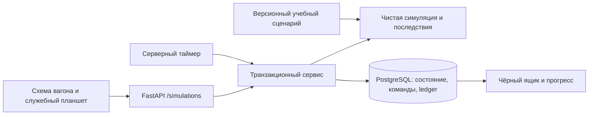

# Операционная смена

## Проверка существующей модели

Граф Scenario → Node → Choice и ScenarioSession хранит одну текущую сцену.
Он остаётся движком отдельных тренировок; последовательная короткая смена также
сохраняется в этом режиме. Параллельные инциденты нельзя выразить переходом одного
current_node без потери независимых дедлайнов.

Повторно используются demo identity, PostgreSQL, блокировки строк, серверное время,
worker, DomainEvent, правила идемпотентности, журнал начислений, профиль и визуальный
язык разбора. Новая симуляция имеет собственный журнал; она не создаёт фиктивные
ScenarioSession ради совместимости с внешними ключами старого ledger.

## Минимальный домен

SimulationState содержит elapsed, status, revision, местоположение проводника,
IncidentState, PassengerState, Equipment, CommunicationRequest, Consequence,
профессиональные метрики и журнал. Домен — чистый Python без HTTP/ORM/Pydantic.
Строго валидируемая JSON-конфигурация живёт в scenarios/simulation отдельно от ядра.
Запущенная смена закрепляет версию определения и seed.

Длительность демо — 1200 секунд. Учебный маршрут Москва → Тверь → Великий Новгород
→ Санкт-Петербург условный: это сжатая симуляция, не реальное расписание ВСМ.
Seed меняет персонажей, начальные состояния, место/время событий и осложнение.

advance(state, elapsed) последовательно обрабатывает все наступившие события,
эскалации, ответы связи и последствия в стабильном порядке. Результат одинаков
при частом polling и одном восстановлении после отключения. Временные переходы
имеют приоритет перед командой ровно на дедлайне. Команды не передают время, seed,
очки, факты или стадию инцидента. Сервер берёт часы после блокировки строки.

Инциденты: reported → investigated → confirmed → handled → resolved; пропуск
времени ведёт к ignored/escalated/critical. Действие «отложить» не приостанавливает
событие. Исследование раскрывает факты; истинная причина и будущие события не
попадают в активную API-проекцию. Поздние последствия могут зависеть от доверия NPC.

Смена содержит просьбу пассажира, конфликт, запах у тамбура, ухудшение самочувствия,
задачу к станции; события перекрываются. Помощь требует связи и оборудования,
некоторые действия разрешены только на стоянке. Никакой диагностики/назначения
лечения: учебные действия — наблюдение, передача симптомов, вызов ответственных.

Safety, Service, RegulationCompliance, Prioritization, Communication — независимые
шкалы 0–100; ReactionTime — наблюдаемое среднее время первой реакции, не процент.
XP начисляется один раз при завершении и отдельно от профессиональных шкал.
Debrief показывает открытие, реакцию, историю стадий, причинные последствия,
изменения метрик и авторские альтернативы, без runtime LLM.

## Интерфейс и сохранение

Основной раздел «Смена»: маршрут/часы, схема зон вагона, контекст выбранной зоны,
список действующих обращений, служебная связь и экипировка. Клавиатура и touch
используют обычные кнопки. Никаких A/B/C/D. Старые сценарии — раздел «Тренировки».
Сервер сохраняет каждый тик/команду атомарно; worker продвигает смену без браузера.
Одна активная симуляция на профиль, ownership на каждом запросе, revision и
command_id защищают от гонок; receipt одинаковой команды не начисляет повторно.

