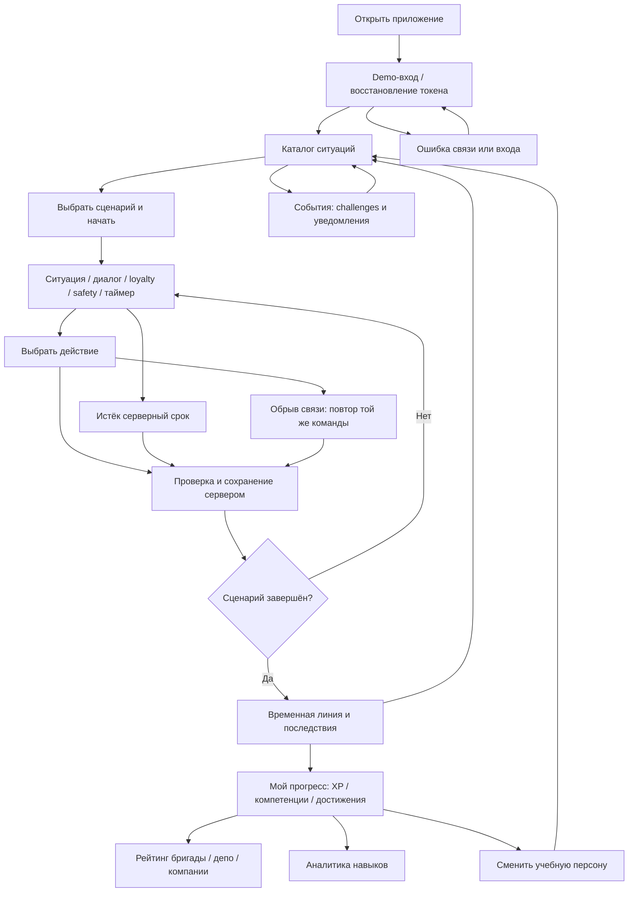
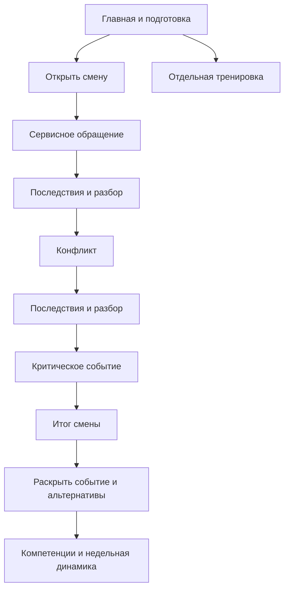

# Пользовательский путь

## Первый запуск

Откройте приложение по адресу из README. UI получает demo-токен для учебного
проводника 01 и загружает каталог. Реальные имя, телефон и email не требуются.
Если соединение недоступно, экран показывает ошибку и повтор загрузки.

## Прохождение

1. Выберите ситуацию радиокнопкой и нажмите «Начать сценарий». Сервер создаёт
   попытку с версией выбранного сценария и начальными loyalty/safety 50/50.
2. Прочитайте сцену. Кнопки содержат только доступные по серверным условиям
   действия; ответ нужно принять до deadline, если он задан.
3. После выбора отправляется команда с ID повтора и ревизией. Повторный ввод
   блокируется на время отправки. Переход показывает объяснение и изменения шкал.
4. При окончании срока сервер применяет отдельный timeout outcome. Он может
   привести в другую сцену или сразу завершить попытку. Закрытие вкладки не
   останавливает время; worker продолжает работать.
5. В финале открывается разбор решений: что выбрано, последствия, почему
   изменились обе шкалы, компетенции, доступные альтернативы и рекомендации.
   Награда учитывается один раз. Reload не создаёт новую награду.

Управление доступно клавиатурой: Tab/Shift+Tab, стрелки в группе выбора сценария,
Enter/Space на кнопках. Есть видимый фокус, адаптивная компоновка и уважение
`prefers-reduced-motion`. Анимации не определяют доступность действия.

## Прогресс и возвращение

«Мой прогресс» показывает учебный паспорт, XP, уровень, компетенции и достижения.
Рейтинг переключается между бригадой, депо и компанией; учитывает реальные
награды синтетических пользователей, поэтому на новой БД он пуст до прохождений.
Аналитика выделяет наблюдения по накопленным попыткам; малое количество данных
не выдаётся за доказанную сильную или слабую компетенцию.

«События» содержит два demo challenge и входящие. Задания учитывают подходящие
попытки автоматически, отдельного join нет. Переход из задания ведёт к ситуации;
сроки и read/unread приходят с сервера. Уведомления с истёкшим сроком остаются
в истории, но не увеличивают число непрочитанных актуальных событий.
Экраны прогресса и событий доступны вне активной игровой сцены.

## Восстановление

Токен, текущая попытка и незавершённая команда хранятся в sessionStorage вкладки.
После reload UI запрашивает серверный снимок; при неопределённом ответе повторяет
исходный decision ID. «Восстановить связь» повторяет запрос, а не начисляет баллы.
Истечение токена требует demo-входа заново. Новая вкладка не обязана восстановить
состояние старой: это не синхронизация активной игры между устройствами.
Сохранённые результаты остаются в БД и принадлежат выбранной demo-персоне.

## Смена как рабочий маршрут

Главная показывает синтетическую персону, состояние смены, личную сводку,
задачу по слабому навыку и последние результаты. «Заступить на учебную смену»
сохраняет маршрут на сервере и открывает первый этап. Выбор сложности влияет
на опубликованную версию событий. Отдельная тренировка доступна в каталоге.

При потере ответа на действие клиент повторяет то же намерение. При обновлении
страницы сервер возвращает сохранённую смену; её этапы нельзя произвольно выбрать.
Истёкший серверный срок не восстанавливается после возвращения в браузер.
Результат смены отдельно показывает XP и профессиональные показатели.
